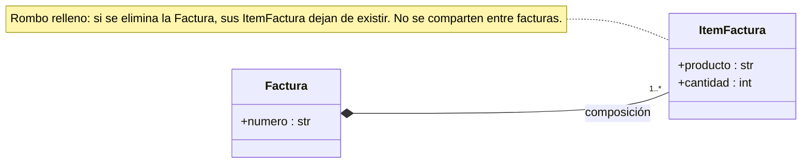
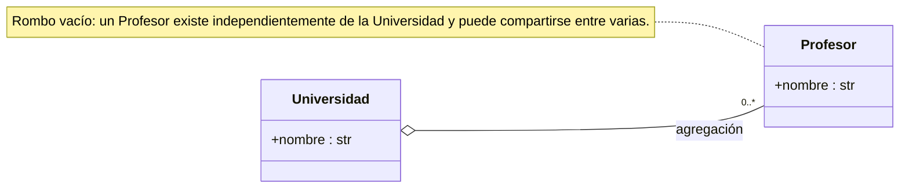
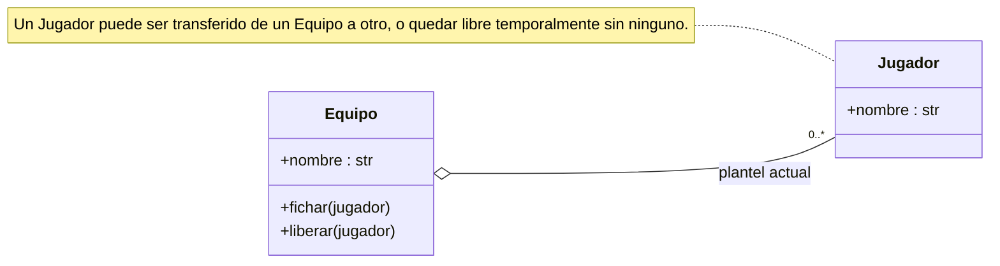
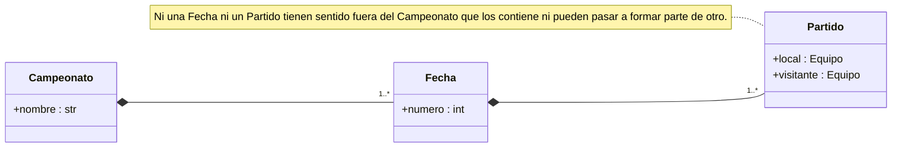

# Agregación (y su diferencia con la composición)

Dentro de las relaciones "todo/parte" UML distingue dos variantes según la fuerza del vínculo entre contenedor y contenidos: [[Composición]] y **agregación**. En una agregación el objeto contenido tiene **existencia propia**, independiente del contenedor, y puede ser compartido por varios contenedores; el contenedor solo mantiene una referencia a objetos que existen —y pueden seguir existiendo— por fuera de él. Ejemplo: un `Profesor` pertenece a la colección de docentes de una `Universidad`, pero puede dictar clases en otra institución, o la universidad puede cerrar sin que el profesor desaparezca.

En el diagrama de clases ambas llevan una línea terminada en un rombo del lado del contenedor: **relleno** en la composición, **vacío** en la agregación.





## Ciclo de vida
- **Composición**: la parte pertenece a un único contenedor y su ciclo de vida está atado al de este. El contenedor es responsable de crear (y conceptualmente destruir) sus partes; si deja de existir, las partes pierden sentido y no pueden reutilizarse. Los ítems de una factura existen solo en el contexto de esa factura.
- **Agregación**: la parte existe por sí misma, puede compartirse entre contenedores y sobrevive a la desaparición de cualquiera de ellos.

## Pertenencia y movilidad
El ciclo de vida es la consecuencia más visible, pero la pregunta de fondo es otra: **¿tiene sentido que este objeto exista fuera de esta relación y pueda pasar a formar parte de otro contenedor?**

- En una agregación, sí: el objeto tiene identidad y un rol que trascienden a cualquier contenedor, puede migrar de uno a otro e incluso pasar períodos sin ninguno. Un `Jugador` puede ser transferido de un `Equipo` a otro y quedar como agente libre sin dejar de ser jugador.
- En una composición, no: el objeto no tiene un rol propio fuera de su contenedor; la pregunta "¿a qué otro contenedor podría pasar?" ni siquiera está bien planteada, porque su identidad está constituida por su pertenencia a ese contenedor.

Ejemplo extremo: un `Campeonato` compuesto de `Fecha`s, que a su vez se componen de `Partido`s. Un `Partido` no puede "despegarse" de su `Fecha` ni pasar a otro campeonato: su identidad ("el partido entre tal fecha del torneo tal") está definida por esa fecha y ese campeonato. En cambio los `Equipo`s que juegan un partido sí tienen existencia propia y participan en otros partidos y campeonatos. **Una misma clase puede ser "parte agregada" en una relación y "contenedor compuesto" en otra**, y ambos vínculos conviven en un mismo modelo.





## Regla práctica para clasificar
Hacerse dos preguntas:
1. ¿Podría el objeto contenido pasar, en algún momento de su vida, a formar parte de **otro** contenedor del mismo tipo? Si sí (aunque sea poco frecuente) → **agregación**.
2. ¿Tiene sentido preguntarse por la existencia del objeto contenido **sin** hacer referencia a ningún contenedor? Si sí (se puede describir y tiene identidad por sí mismo) → también **agregación**.

Si ambas respuestas son negativas → **composición**: el objeto está definido *en función de* su contenedor, no simplemente alojado *dentro de* él.

## Resumen comparativo

| | Composición (rombo lleno) | Agregación (rombo vacío) |
|---|---|---|
| Existencia de la parte | Atada al contenedor | Propia, independiente |
| Compartir entre contenedores | No | Sí |
| Migrar a otro contenedor | No tiene sentido | Sí, incluso quedar sin ninguno |
| Método de agregado | El contenedor **instancia** las partes | Recibe una instancia **creada afuera** |
| Método de borrado | **No** devuelve el objeto removido | **Devuelve** el objeto removido |
| Ejemplos | `ItemFactura`/`Factura`, `Libro`/`Biblioteca`, `Partido`/`Fecha` | `Profesor`/`Universidad`, `Jugador`/`Equipo` |

## Implementación en Python
La distinción **no tiene traducción sintáctica**: en ambos casos la contenedora guarda una referencia (o una colección de [[Referencias|referencias]]) a instancias de la clase contenida. Python tampoco permite expresar "este objeto es responsable de destruir a sus partes": la memoria se gestiona por conteo de referencias y un objeto vive mientras exista al menos una referencia, sin importar de qué relación venga. Por eso la diferencia es una **decisión de diseño y de documentación del modelo**, una convención que el programador respeta:

- **Composición**: la contenedora es la única que instancia las partes (generalmente en un método de agregado como `agregar_libro`) y no expone métodos que dejen a otro objeto insertar referencias arbitrarias o "robar" una parte.
- **Agregación**: es habitual que el método de agregado reciba una instancia ya creada por fuera (`universidad.agregar_profesor(profesor)`, donde `profesor` podría agregarse también a `otra_universidad`).

Lo mismo, en espejo, para los métodos que **remueven**: lo relevante es qué le entregan a quien los invoca.

**Agregación** — `liberar` devuelve el objeto removido, lo que permite reasignarlo a otro contenedor:

```python
class Jugador:
    def __init__(self, nombre):
        self.nombre = nombre

class Equipo:
    def __init__(self, nombre):
        self.nombre = nombre
        self.jugadores = []

    def fichar(self, jugador):
        self.jugadores.append(jugador)

    def liberar(self, nombre):
        coincidencias = list(j for j in self.jugadores if j.nombre == nombre)
        if coincidencias:
            jugador = coincidencias[0]
            self.jugadores.remove(jugador)
            return jugador

# El jugador migra de un equipo a otro
equipo1 = Equipo("Deportivo Buenaventura")
equipo2 = Equipo("Heladeros Fútbol Club")
goleador = Jugador("Perez")
equipo1.fichar(goleador)

# Más adelante
goleador = equipo1.liberar("Perez")
if goleador:
    equipo2.fichar(goleador)
```

Si no hay coincidencia, `liberar` retorna `None` implícitamente; por eso se verifica `if goleador:` antes de fichar.

**Composición** — `quitar_libro` **no** devuelve el libro: dárselo a quien llama sería entregar una referencia utilizable a una parte que no tiene sentido fuera de su contenedor y que podría terminar insertada en otra `Biblioteca`, violando la exclusividad de la composición. Como mucho puede devolver un booleano o nada:

```python
class Biblioteca:
    def __init__(self):
        self.libros = []

    def agregar_libro(self, libro):
        self.libros.append(libro)

    def quitar_libro(self, libro):
        self.libros.remove(libro)
        # No se retorna el libro: su ciclo de vida termina aquí,
        # no tiene sentido que pase a integrar otra Biblioteca.
```

Esta asimetría en la firma de los métodos de borrado es la contraparte exacta de la asimetría semántica; no la impone el lenguaje.

## Conceptos relacionados
- [[Composición]] — la variante fuerte
- [[Referencias]] — por qué el lenguaje no distingue ambas
- [[Herencia]] — otra relación entre clases ("ES UN")
- [[Listas]] — colección donde suelen guardarse las partes
- [[Encapsulamiento]] — quién puede insertar o quitar partes

## Visto en
- [[Unidad 4 - Clases, encapsulamiento y composición]] · [[semana4.pdf#page=24|semana4.pdf, §9.4 Composición vs. Agregación (p. 24-30)]]
