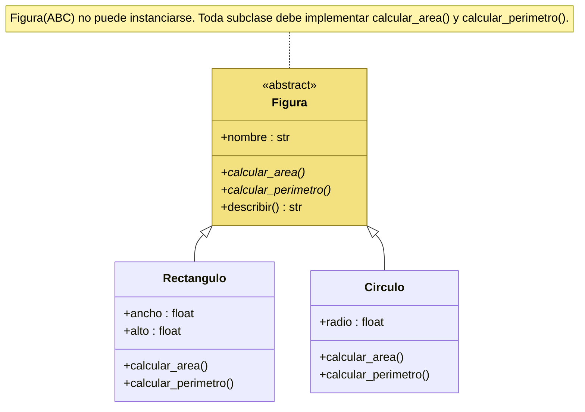

# Clases y métodos abstractos

Una **clase abstracta** no puede instanciarse directamente y suele contener uno o más **métodos abstractos**: declaraciones de métodos que las clases derivadas deben implementar obligatoriamente pero que no tienen implementación en la base. Funcionan como plantillas o **contratos**: definen qué métodos deben implementar las derivadas y garantizan una interfaz común entre implementaciones distintas. Son útiles cuando hay un comportamiento común pero la implementación específica varía en cada subclase.

## En Python: módulo `abc`
Para crear un método abstracto se usa el decorador `@abstractmethod` y la clase debe heredar de `ABC` (*Abstract Base Classes*):

```python
from abc import ABC, abstractmethod

class Figura(ABC):
    def __init__(self, nombre):
        self.nombre = nombre

    @abstractmethod
    def calcular_area(self):
        pass

    @abstractmethod
    def calcular_perimetro(self):
        pass

    def describir(self):
        return f"Figura: {self.nombre}"

class Rectangulo(Figura):
    def __init__(self, ancho, alto):
        super().__init__("Rectángulo")
        self.ancho = ancho
        self.alto = alto

    def calcular_area(self):
        return self.ancho * self.alto

    def calcular_perimetro(self):
        return 2 * (self.ancho + self.alto)

class Circulo(Figura):
    def __init__(self, radio):
        super().__init__("Círculo")
        self.radio = radio

    def calcular_area(self):
        return 3.14159 * self.radio ** 2

    def calcular_perimetro(self):
        return 2 * 3.14159 * self.radio
```



Una clase abstracta **puede** tener métodos concretos (`describir`) y constructor, que las derivadas reutilizan con [[Función super|`super().__init__()`]].

## Qué pasa si se incumple el contrato
Si se intenta instanciar `Figura` directamente, o crear una subclase que no implemente **todos** los métodos abstractos, Python lanza un `TypeError` (ver [[Excepciones]]). Eso garantiza que todas las derivadas cumplan el contrato de la abstracta.

## Conceptos relacionados
- [[Interfaces]] — clases abstractas con *solo* métodos abstractos
- [[Herencia]] — las derivadas heredan de la abstracta
- [[Polimorfismo]] — el código cliente opera sobre `Figura` sin importar la subclase
- [[Sobreescritura de métodos]] — implementar los abstractos es sobreescribirlos
- [[Excepciones]] — `TypeError` al instanciar una abstracta

## Visto en
- [[Unidad 5 - Herencia, polimorfismo y testing]] · [[semana5.pdf#page=10|semana5.pdf, §11.2 Clases y métodos abstractos (p. 10-12)]]
