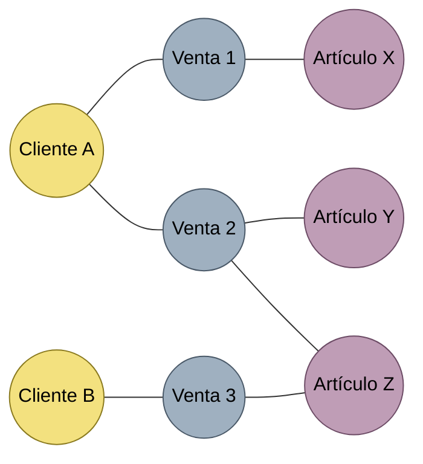
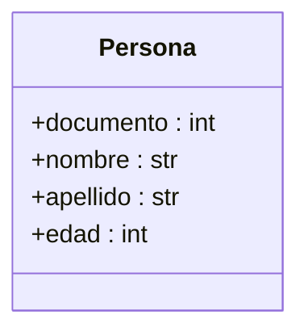

# Clases y objetos

Una **clase** es una plantilla —un modelo o plano— que define la estructura y el comportamiento comunes a un conjunto de objetos para los que se aplica la misma definición. Un **objeto** es una instancia individual y concreta de una clase: comparte las características y los métodos de su clase, pero tiene sus propios valores de atributos y responde de forma independiente a los mensajes que recibe.

Al resolver un problema con [[Programación orientada a objetos|POO]] se lo representa mediante objetos y las relaciones entre ellos; cada objeto encapsula su propio estado (atributos) y comportamiento (métodos). Dos objetos que realizan compras en un comercio tienen el mismo conjunto de datos y hacen las mismas acciones: ambos se clasifican como `Cliente`.

## Objetos y sus relaciones
Los objetos de un sistema de ventas forman una red. Cada color es el rol que cumple el objeto en el dominio, es decir, su clase: amarillo = `Cliente`, gris = `Venta`, violeta = `Artículo`.



Sin colores (figura 7.3 del PDF) es solo "objetos y sus relaciones"; al clasificarlos por rol (figura 7.4) se ve que hay tres clases con varias instancias cada una.

## Sintaxis de la clase
```python
class NombreClase:
    # definición de métodos
```
- El nombre es un sustantivo en singular con notación **Pascal**: inicial en mayúscula y, si son varias palabras, sin delimitador y con mayúscula en la primera letra de cada una (`CodigoPostal`).
- Puede programarse en cualquier archivo, fuera de una función, pero lo usual es un archivo por clase con su mismo nombre (`persona.py`) y usarla con `from persona import *` (ver [[Módulos y docstrings]]).

## Atributos
No se declaran con una construcción gramatical especial: se crean asignándolos dentro de algún método, normalmente el [[Constructor]]. Para diferenciarlos de las variables locales se usa siempre la sintaxis `objeto.atributo`; dentro de la clase, `self.atributo`.

Diagrama de clases de `Persona` (documento, nombre, apellido, edad):



## Conceptos relacionados
- [[Programación orientada a objetos]] — el paradigma
- [[Constructor]] — donde se crean e inicializan los atributos
- [[Métodos]] — el comportamiento de los objetos
- [[Referencias]] — cómo las variables apuntan a los objetos
- [[Encapsulamiento]] y [[Propiedades]] — proteger los atributos
- [[Módulos y docstrings]] — una clase por archivo

## Visto en
- [[Unidad 4 - Clases, encapsulamiento y composición]] · [[semana4.pdf#page=4|semana4.pdf, §7.1.2-§7.3 (p. 4-6)]]
