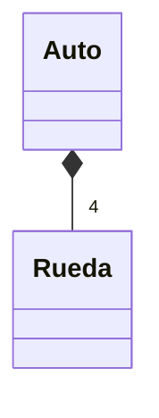
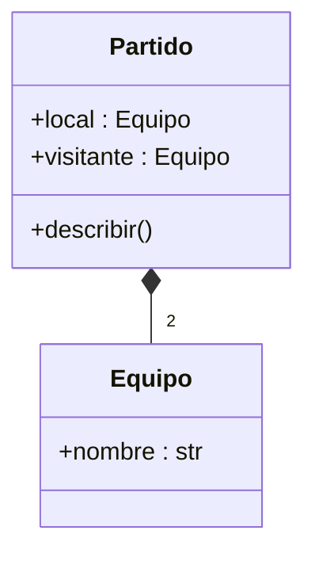
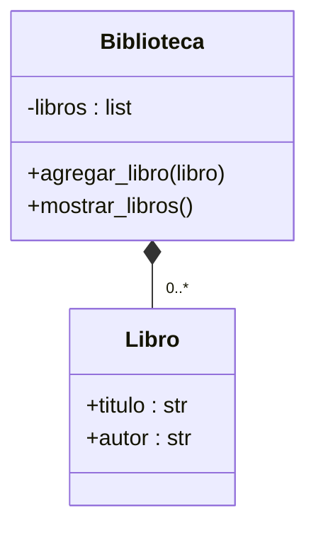

# Composición

Principio para crear objetos complejos combinándolos a partir de objetos más simples: es una relación entre clases en la que un objeto **se compone de otros objetos** como partes constituyentes. El objeto compuesto tiene [[Referencias|referencias]] a esos objetos como atributos y usa sus métodos para realizar acciones específicas. Es la relación correcta cuando la prueba "ES UN" de la [[Herencia]] no se cumple: una `Rueda` no es un `Auto`, pero un `Auto` *tiene* cuatro `Rueda`.



Hay una segunda variante de relación "todo/parte", más débil: la [[Agregación]]. La diferencia está en si la parte puede existir por fuera del contenedor.

## Cardinalidad
La implementación varía según la cantidad de objetos que intervienen en la relación.

### Cardinalidad constante
Si es 0, 1 o una cantidad fija, alcanza con **referencias simples**: atributos de la clase compuesta cuyo tipo es el de la clase contenida, recibidos y asignados directamente en el constructor. Ejemplo: un `Partido` está compuesto de exactamente dos `Equipo`.



```python
class Equipo:
    def __init__(self, nombre):
        self.nombre = nombre

class Partido:
    def __init__(self, local, visitante):
        self.local = local
        self.visitante = visitante

    def describir(self):
        print(f"{self.local.nombre} vs {self.visitante.nombre}")

# Crear equipos
equipo1 = Equipo("Boca Juniors")
equipo2 = Equipo("River Plate")

# Crear un partido entre ambos equipos
partido = Partido(equipo1, equipo2)
partido.describir()
```

> [!note] Sobre este ejemplo en el PDF
> En §9.5.1 se dibuja `Partido` con rombo lleno hacia `Equipo` solo para ilustrar la cardinalidad fija. En §9.4.2, en cambio, el mismo PDF aclara que la relación de `Partido` hacia `Equipo` es una **agregación**, porque los equipos tienen existencia propia y participan en otros partidos. Lo que muestra el ejemplo es la implementación (referencias simples en el constructor), que es igual en ambos casos.

### Cardinalidad variable
Cuando el compuesto se relaciona con una cantidad grande, variable o desconocida de objetos, se usa una **colección** (lista o diccionario). Un `Equipo` tiene muchos `Jugador`; una `Biblioteca` está compuesta de 0 o más `Libro`.



```python
class Libro:
    def __init__(self, titulo, autor):
        self.titulo = titulo
        self.autor = autor

class Biblioteca:
    def __init__(self):
        self.libros = []

    def agregar_libro(self, libro):
        self.libros.append(libro)

    def mostrar_libros(self):
        for libro in self.libros:
            print(f"Título: {libro.titulo}, Autor: {libro.autor}")

# Crear libros
libro1 = Libro("El Gran Gatsby", "F. Scott Fitzgerald")
libro2 = Libro("Cien Años de Soledad", "Gabriel García Márquez")

# Crear una biblioteca y agregar libros
biblioteca = Biblioteca()
biblioteca.agregar_libro(libro1)
biblioteca.agregar_libro(libro2)

# Mostrar los libros en la biblioteca
biblioteca.mostrar_libros()
```

## Esquema de implementación con colecciones
1. En la clase **contenedora**, agregar un atributo de alguno de los tipos de colección ([[Listas]], [[Diccionarios]]).
2. En su [[Constructor]] **no** recibir la colección por parámetro: solo se instancia vacía.
3. **No** agregar métodos de asignación ni consulta para la colección (respeta el [[Encapsulamiento]]).
4. Agregar un método de agregado que reciba una instancia de la clase contenida (`agregar_libro`).
5. Todas las responsabilidades que involucren a la colección se programan como métodos de la contenedora (`mostrar_libros`).

## Conceptos relacionados
- [[Agregación]] — la relación "todo/parte" con partes independientes
- [[Herencia]] — "ES UN" vs. "tiene un"
- [[Referencias]] — el compuesto guarda referencias a sus partes
- [[Listas]] y [[Diccionarios]] — colecciones para cardinalidad variable
- [[Encapsulamiento]] — la colección no se expone
- [[Pytest]] — la clase `Numeros` del ejemplo de testing es una composición de una lista

## Visto en
- [[Unidad 4 - Clases, encapsulamiento y composición]] · [[semana4.pdf#page=23|semana4.pdf, §9.1-§9.3 y §9.5 (p. 23-24 y 30-31)]]
