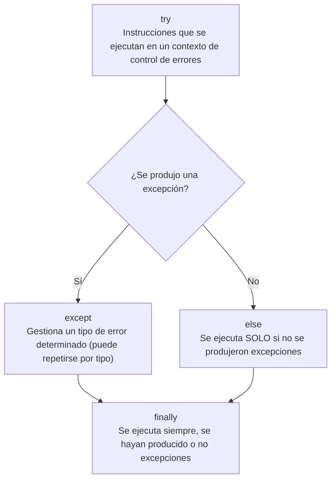

# Excepciones y gestión de errores

Una excepción es una condición de error no prevista. En vez de verificar manualmente cada resultado (estilo estructurado clásico), el lenguaje detecta la condición anómala y el programador define bloques de manejo — código más claro y compacto.

## Captura (`except`) y disparo (`raise`)
```python
try:
    a = b / c
except ZeroDivisionError:
    print("El divisor de la expresión es 0 (cero)")
```
```python
if c == 0:
    raise ZeroDivisionError
```

## Tipos comunes
| Excepción | Cuándo ocurre |
|---|---|
| `TypeError` | Operación sobre tipo inapropiado |
| `ZeroDivisionError` | División por cero |
| `OverflowError` | Cálculo excede el límite numérico |
| `IndexError` | Índice inexistente en una [[Secuencias\|secuencia]] |
| `KeyError` | Clave inexistente en un [[Diccionarios\|diccionario]] |
| `FileNotFoundError` | [[Archivos|Archivo]] inexistente en la ruta indicada |
| `ImportError` | Falla al importar un módulo |

## Estructura completa: try / except / else / finally
- `try` — código en condiciones normales.
- `except tipo:` — puede repetirse para distintos tipos.
- `else` — se ejecuta solo si **no** hubo excepción.
- `finally` — se ejecuta siempre, haya o no excepción.

Estructura completa de un bloque de excepción (figura 5.1 del PDF, redibujada como flujo):



```python
def division(a, b):
    try:
        result = a / b
    except ZeroDivisionError:
        print('¡No se puede dividir por cero!')
    else:
        print(result)
```

## Excepciones definidas por el programador
Se heredan de la clase base `Exception`:
```python
class SalarioInsuficiente(Exception):
    def __init__(self, salario, message="El salario no está entre (5000, 15000)."):
        self.salario = salario
        self.message = message
        super().__init__(self.message)

raise SalarioInsuficiente(1200)
```

## Relacionado
- [[Archivos]] — `FileNotFoundError` al abrir
- [[Diccionarios]] — `KeyError` al acceder con `[]`
- [[Secuencias]] — `IndexError` al indexar fuera de rango
- [[Aserciones en pytest]] — `pytest.raises` verifica que se lance una excepción
- [[Encapsulamiento]] — rechazar valores inválidos lanzando una excepción
- [[Python - Mapa de Contenidos]]

## Visto en
- [[Unidad 3 - Archivos, colecciones avanzadas y excepciones]] · [[semana3.pdf#page=29|semana3.pdf, cap. 5 Excepciones y gestión de errores (p. 29-33)]]
