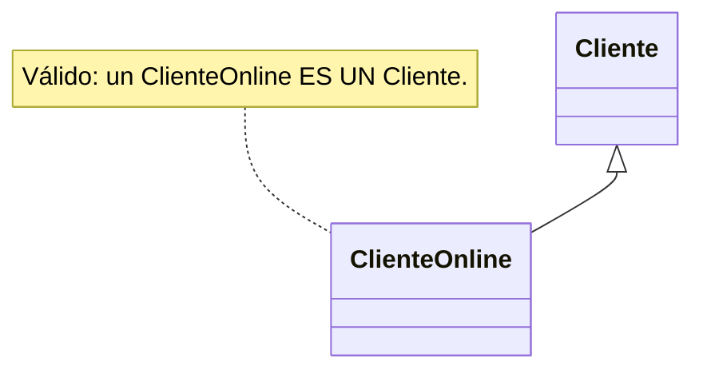
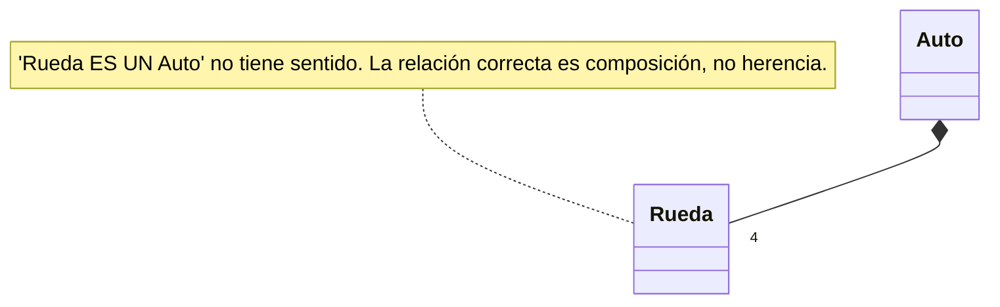
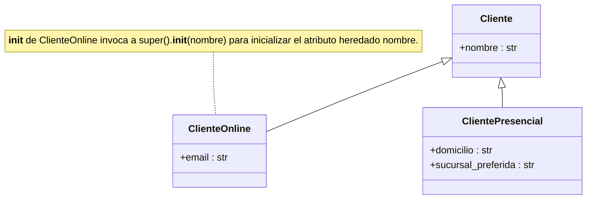

# Herencia

Relación entre clases que se aplica cuando existen clases parecidas pero no lo bastante idénticas como para ser una sola. Permite crear una **clase derivada** (subclase) a partir de una **clase base** (superclase) sin copiar y pegar su código: la derivada hereda propiedades y métodos de la base, y puede agregar funcionalidad nueva o modificar la existente. Así los objetos de ambas clases pueden usarse de manera equivalente y se evita un mantenimiento engorroso y propenso a errores. Ejemplo: una clase base `Vehiculo` con `acelerar` y `frenar`, y subclases `Automovil` y `Motocicleta` que heredan eso y agregan lo propio.

En síntesis: la herencia permite tratar de manera uniforme objetos de clases relacionadas, evitando duplicar código y reutilizando estructura y comportamiento común.

## La prueba "ES UN"
Un objeto de la clase derivada **ES UN** objeto de la clase base. Conviene verificar toda herencia con esa frase: si no tiene sentido, es síntoma de que las clases no deben relacionarse, o de que lo hacen por otro tipo de relación.

- Válido: "un `ClienteOnline` ES UN `Cliente`".
- Inválido: "una `Rueda` ES UN `Auto`" (ni "un `Auto` ES UNA `Rueda`"). Se relacionan por [[Composición]], no por herencia.





## Implementación en Python
En la clase base **no se modifica nada**. En la derivada se indica, en la cabecera del `class`, el nombre de la base entre paréntesis:

```python
class ClienteOnline(Cliente):
    ...
```

Todo miembro de la base es heredado y por lo tanto accesible mediante `self`.

## Constructor de la clase derivada
El constructor de la derivada recibe parámetros para inicializar sus atributos propios **y** los heredados, y luego invoca explícitamente al de la base con [[Función super|`super()`]]. Los parámetros de la derivada normalmente no coinciden con los que se reenvían: además de los que la base necesita, recibe otros propios, y le corresponde a la derivada elegir cuáles pasar a `super().__init__()`.

```python
class Cliente:
    def __init__(self, nombre):
        self.nombre = nombre

class ClienteOnline(Cliente):
    def __init__(self, nombre, email):
        # nombre se reenvía tal cual a la base; email es un
        # parámetro propio de ClienteOnline, que Cliente desconoce.
        super().__init__(nombre)
        self.email = email

class ClientePresencial(Cliente):
    def __init__(self, nombre, domicilio, sucursal_preferida):
        # domicilio y sucursal_preferida tampoco existen en Cliente:
        # son propios de un cliente que opera en una sucursal física,
        # probablemente la más cercana a su domicilio.
        super().__init__(nombre)
        self.domicilio = domicilio
        self.sucursal_preferida = sucursal_preferida

# Crear un cliente online
cliente1 = ClienteOnline("Ana Gómez", "ana.gomez@correo.com")

# Crear un cliente presencial
cliente2 = ClientePresencial("Beto Ruiz", "Av. Gutierrez 742", "Sucursal Centro")
```



## Conceptos relacionados
- [[Función super]] — invocar la versión de la base
- [[Sobreescritura de métodos]] — redefinir métodos heredados
- [[Polimorfismo]] — tratar la jerarquía de forma uniforme
- [[Clases abstractas]] e [[Interfaces]] — bases que definen un contrato
- [[Composición]] — relación "tiene un" cuando "ES UN" falla
- [[Constructor]] — el de la derivada delega en el de la base
- [[Programación orientada a objetos]]

## Visto en
- [[Unidad 5 - Herencia, polimorfismo y testing]] · [[semana5.pdf#page=1|semana5.pdf, cap. 10 Herencia (p. 1-6)]]
