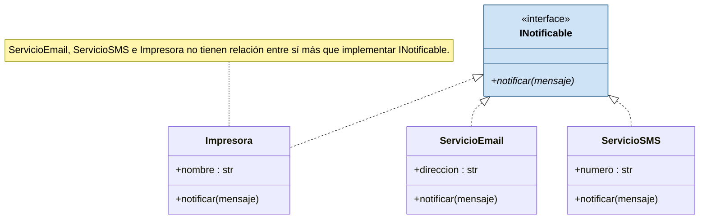
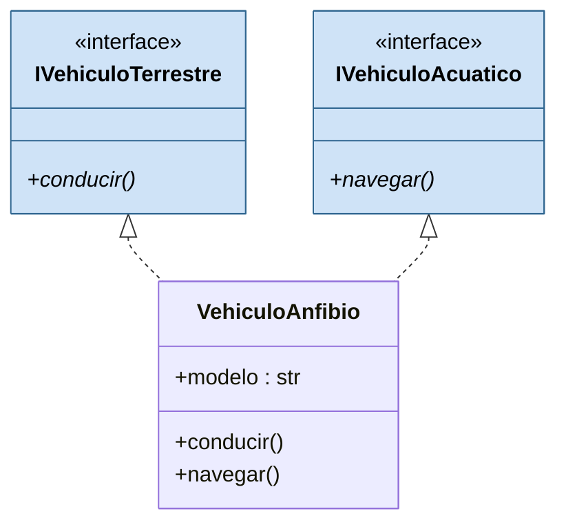

# Interfaces

Una interfaz define un conjunto de métodos que una clase debe implementar **sin dar la implementación**. En UML es un contrato que especifica *qué* servicios debe proveer una clase, pero no *cómo*. Python no tiene una palabra clave para interfaces: se las implementa con [[Clases abstractas|clases abstractas]] que contienen **únicamente métodos abstractos**.

## Cuándo aportan valor
No cuando la implementa una sola clase, sino cuando la implementan **varias clases sin relación entre sí** —sin clase base común más allá de la interfaz, ni dominio conceptual compartido—. Lo único que las vincula es haberse comprometido con el mismo contrato, y eso alcanza para que un tercero las trate de manera uniforme sin conocer su tipo concreto.

```python
from abc import ABC, abstractmethod

class INotificable(ABC):
    @abstractmethod
    def notificar(self, mensaje):
        pass

class ServicioEmail(INotificable):
    def __init__(self, direccion):
        self.direccion = direccion

    def notificar(self, mensaje):
        print(f"Enviando email a {self.direccion}: {mensaje}")

class ServicioSMS(INotificable):
    def __init__(self, numero):
        self.numero = numero

    def notificar(self, mensaje):
        print(f"Enviando SMS al {self.numero}: {mensaje}")

class Impresora(INotificable):
    def __init__(self, nombre):
        self.nombre = nombre

    def notificar(self, mensaje):
        print(f"Imprimiendo aviso en {self.nombre}: {mensaje}")
```



`ServicioEmail`, `ServicioSMS` e `Impresora` modelan tres cosas completamente distintas —un servicio de correo, una pasarela de SMS, un dispositivo de impresión— y no derivan unas de otras. Gracias a eso, una función cliente recibe una **colección heterogénea** y notifica a todos por igual, **sin `if` ni `isinstance`**:

```python
def notificar_a_todos(destinatarios, mensaje):
    for destinatario in destinatarios:
        destinatario.notificar(mensaje)

destinatarios = [
    ServicioEmail("ana@empresa.com"),
    ServicioSMS("+54 9 351 555-0123"),
    Impresora("Impresora de Recepción"),
]

notificar_a_todos(destinatarios, "Reunión de personal a las 15hs")
```

Es la idea central: construir código que opera sobre el **contrato**, desacoplado de las clases concretas que lo cumplen ([[Polimorfismo]]).

## Múltiples interfaces
Una clase puede implementar más de una interfaz indicando varias bases entre paréntesis, igual que en [[Herencia]]. Parece herencia múltiple, pero conceptualmente es distinto y mucho más seguro.

- **Herencia múltiple** propiamente dicha: dos o más bases aportan *implementación* (atributos, cuerpos de métodos concretos) a una misma derivada. Surge el **problema del diamante**: si dos bases definen un método con el mismo nombre y distinta implementación, no hay forma no ambigua de decidir cuál se hereda. Es el motivo por el que otros lenguajes no permiten extender más de una clase concreta.
- **Múltiples interfaces**: lo que se declara entre paréntesis son ABCs compuestas solo de métodos abstractos; no hay implementación en conflicto que heredar. Cada interfaz aporta un contrato, nunca un cuerpo que pueda colisionar con otro.

```python
class IVehiculoTerrestre(ABC):
    @abstractmethod
    def conducir(self):
        pass

class IVehiculoAcuatico(ABC):
    @abstractmethod
    def navegar(self):
        pass

class VehiculoAnfibio(IVehiculoTerrestre, IVehiculoAcuatico):
    def __init__(self, modelo):
        self.modelo = modelo

    def conducir(self):
        print(f"{self.modelo} está conduciendo en tierra")

    def navegar(self):
        print(f"{self.modelo} está navegando en agua")
```



Un `VehiculoAnfibio` se trata polimórficamente como `IVehiculoTerrestre` o como `IVehiculoAcuatico` según el contexto, replicando las interfaces múltiples de UML.

## Conceptos relacionados
- [[Clases abstractas]] — con lo que se implementa una interfaz
- [[Polimorfismo]] — tratar clases distintas de forma uniforme
- [[Herencia]] — herencia múltiple y problema del diamante
- [[Sobreescritura de métodos]] — implementar el contrato

## Visto en
- [[Unidad 5 - Herencia, polimorfismo y testing]] · [[semana5.pdf#page=12|semana5.pdf, §11.3 Interfaces (p. 12-15)]]
