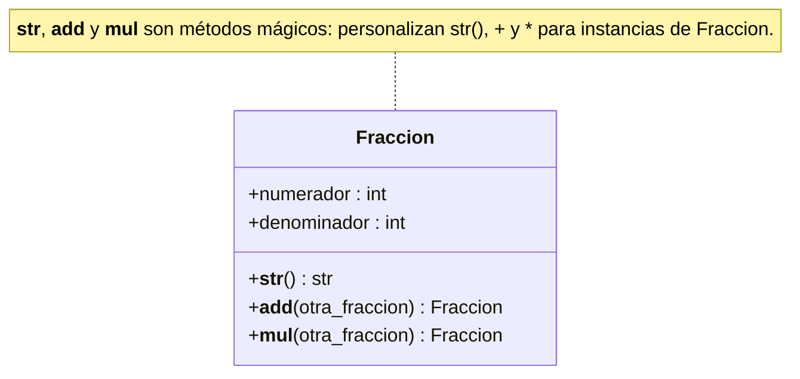

# Métodos mágicos (dunder)

Métodos cuyos nombres empiezan y terminan con dos guiones bajos (`__`), por eso también llamados *dunder methods* (*double underscore*). Su rasgo distintivo es que **se invocan de forma implícita**: no se los llama con la sintaxis normal de envío de mensajes, sino que Python los ejecuta automáticamente a partir de otras operaciones (crear un objeto, `print`, un operador…). El más conocido es `__init__` (ver [[Constructor]]).

## Para qué sirven
Los tipos simples (números, booleanos, cadenas) participan en operaciones gracias a los [[Operadores|operadores]]. Los objetos de una clase propia no: al comparar dos objetos por igualdad solo se obtiene si ambas [[Referencias|referencias]] apuntan al mismo objeto, y no existe una forma natural de decir "mayor que" o "menor que". Python **no puede adivinar** cómo comparar o sumar objetos propios, porque eso depende de la lógica de negocio de cada aplicación. Los métodos mágicos le permiten al programador definir esa lógica y así personalizar el comportamiento de sus clases (*sobrecarga de operadores*).

| Método | Se activa con | Uso |
|---|---|---|
| `__init__` | `Clase(...)` | Constructor |
| `__str__` | `print(obj)`, `str(obj)` | Representación como cadena |
| `__eq__` | `==` | Igualdad |
| `__ne__` | `!=` | Desigualdad |
| `__lt__` | `<` | Menor que |
| `__gt__` | `>` | Mayor que |
| `__le__` | `<=` | Menor o igual |
| `__ge__` | `>=` | Mayor o igual |
| `__add__` | `+` | Suma |
| `__mul__` | `*` | Multiplicación |

## `__str__`
Devuelve una representación en cadena del estado interno del objeto (todos o algunos de sus atributos). Equivale al `toString` de Java o C# y al `asString` de SmallTalk. Como Python lo invoca solo, `print(objeto)` muestra lo que el objeto decide informar de sí mismo. En clases derivadas se suele extender con `super().__str__()` — ver [[Polimorfismo]] y [[Función super]].

## Comparación
`__eq__` determina si un objeto es igual a otro según el criterio del programador; por ejemplo, en `Persona`, que devuelva `True` si todos los atributos de dos objetos coinciden. `__ne__`, `__lt__`, `__gt__`, `__le__` y `__ge__` habilitan el resto de las comparaciones con sus operadores.

## Aritméticos: la clase `Fraccion`
Ejemplo de la cátedra: sobrecargar `+` y `*` para sumar y multiplicar fracciones. El constructor simplifica la fracción con el máximo común divisor.

```python
from math import gcd

class Fraccion:
    def __init__(self, numerador, denominador):
        # Simplificamos la fracción al máximo común divisor
        divisor_comun = gcd(numerador, denominador)
        self.numerador = numerador // divisor_comun
        self.denominador = denominador // divisor_comun

    def __str__(self):
        return f'{self.numerador}/{self.denominador}'

    def __add__(self, otra_fraccion):
        # Suma de fracciones: (a/b) + (c/d) = (ad + bc) / bd
        nuevo_numerador = (self.numerador * otra_fraccion.denominador) + \
                          (otra_fraccion.numerador * self.denominador)
        nuevo_denominador = self.denominador * otra_fraccion.denominador
        return Fraccion(nuevo_numerador, nuevo_denominador)

    def __mul__(self, otra_fraccion):
        # Multiplicación de fracciones: (a/b) * (c/d) = (ac) / (bd)
        nuevo_numerador = self.numerador * otra_fraccion.numerador
        nuevo_denominador = self.denominador * otra_fraccion.denominador
        return Fraccion(nuevo_numerador, nuevo_denominador)

# Crear dos objetos Fraccion
frac1 = Fraccion(1, 2)
frac2 = Fraccion(3, 4)

# Sumar dos fracciones usando el operador +
suma = frac1 + frac2
print(f'Suma: {frac1} + {frac2} = {suma}')                    # Suma: 1/2 + 3/4 = 5/4

# Multiplicar dos fracciones usando el operador *
producto = frac1 * frac2
print(f'Multiplicación: {frac1} * {frac2} = {producto}')      # Multiplicación: 1/2 * 3/4 = 3/8
```

Con estos métodos se opera con fracciones de forma más clara e intuitiva que invocando métodos con nombre.



## Conceptos relacionados
- [[Constructor]] — `__init__`
- [[Operadores]] — los que se sobrecargan
- [[Polimorfismo]] — `__str__` redefinido en clases derivadas
- [[Función super]] — reutilizar `__str__` de la base
- [[Referencias]] — la comparación por defecto es por identidad
- [[Métodos]] — invocación explícita vs. implícita

## Visto en
- [[Unidad 4 - Clases, encapsulamiento y composición]] · [[semana4.pdf#page=18|semana4.pdf, §8.4 Métodos mágicos (p. 18-22)]]
