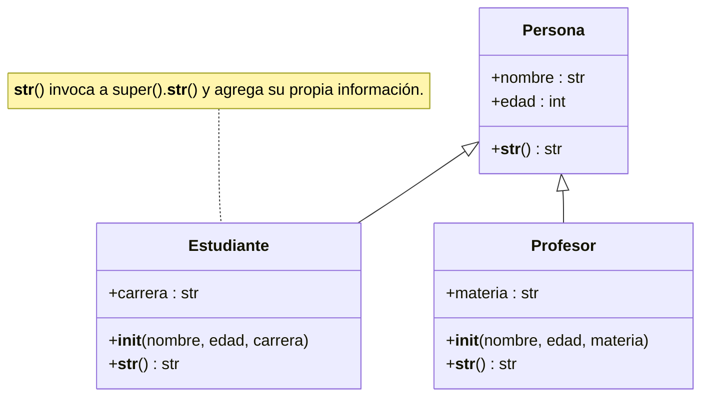

# Polimorfismo

Principio de la [[Programación orientada a objetos|POO]] que permite que objetos de **diferentes clases** sean tratados como objetos de una clase común. Un mismo método puede comportarse de manera distinta según el tipo específico del objeto que lo recibe, lo que da flexibilidad y extensibilidad al código. El término viene del griego y significa "muchas formas": un mismo nombre de método tiene múltiples implementaciones según la clase. En el contexto de la [[Herencia|herencia]] se manifiesta cuando las derivadas redefinen métodos de la base ([[Sobreescritura de métodos]]).

## El efecto real
Se aprecia cuando **un mismo fragmento de código** trata a objetos de distintas clases derivadas de manera uniforme, sin saber con cuál trata. Alcanza con saber que todos son `Vehiculo` para invocar `acelerar()` sobre cualquiera; la implementación que se ejecuta depende del tipo concreto de cada objeto:

```python
vehiculos = [Automovil(), Motocicleta()]

for vehiculo in vehiculos:
    vehiculo.acelerar()
```

El `for` es idéntico para ambos elementos, pero el mensaje se envía en cada vuelta a la implementación de la **clase real** del objeto: la de `Automovil` en la primera, la de `Motocicleta` en la segunda. Eso distingue al polimorfismo de simplemente "tener cada clase su propio método": lo relevante no es que existan varias implementaciones, sino que **el código que las invoca es único e ignora cuál se va a ejecutar**.

## Uso de `super()` al extender `__str__`
Suele hacer falta *extender* la representación de la base en vez de reemplazarla. Al sobreescribir `__str__` en la derivada se invoca `super().__str__()` y se agrega lo específico, logrando cadenas más completas y jerárquicas y evitando duplicar código (ver [[Función super]] y [[Métodos mágicos]]):

```python
class Persona:
    def __init__(self, nombre, edad):
        self.nombre = nombre
        self.edad = edad

    def __str__(self):
        return f"Persona: {self.nombre}, {self.edad} años"

class Estudiante(Persona):
    def __init__(self, nombre, edad, carrera):
        super().__init__(nombre, edad)
        self.carrera = carrera

    def __str__(self):
        return f"{super().__str__()}, Carrera: {self.carrera}"

class Profesor(Persona):
    def __init__(self, nombre, edad, materia):
        super().__init__(nombre, edad)
        self.materia = materia

    def __str__(self):
        return f"{super().__str__()}, Materia: {self.materia}"
```



`print(Estudiante("Ana", 20, "Sistemas"))` muestra `Persona: Ana, 20 años, Carrera: Sistemas`.

## Otras formas de lograrlo
- Con [[Clases abstractas]]: la base declara métodos que **todas** las derivadas deben implementar.
- Con [[Interfaces]]: clases sin relación entre sí se tratan de manera uniforme porque cumplen el mismo contrato.

## Conceptos relacionados
- [[Herencia]] — la jerarquía sobre la que se apoya
- [[Sobreescritura de métodos]] — el mecanismo
- [[Función super]] — reutilizar la versión de la base
- [[Clases abstractas]] e [[Interfaces]] — polimorfismo por contrato
- [[Métodos mágicos]] — `__str__`
- [[Encapsulamiento]] — el otro principio ligado al paso de mensajes

## Visto en
- [[Unidad 5 - Herencia, polimorfismo y testing]] · [[semana5.pdf#page=7|semana5.pdf, cap. 11 Polimorfismo, §11.1 (p. 7-10)]]
