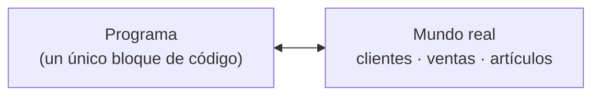
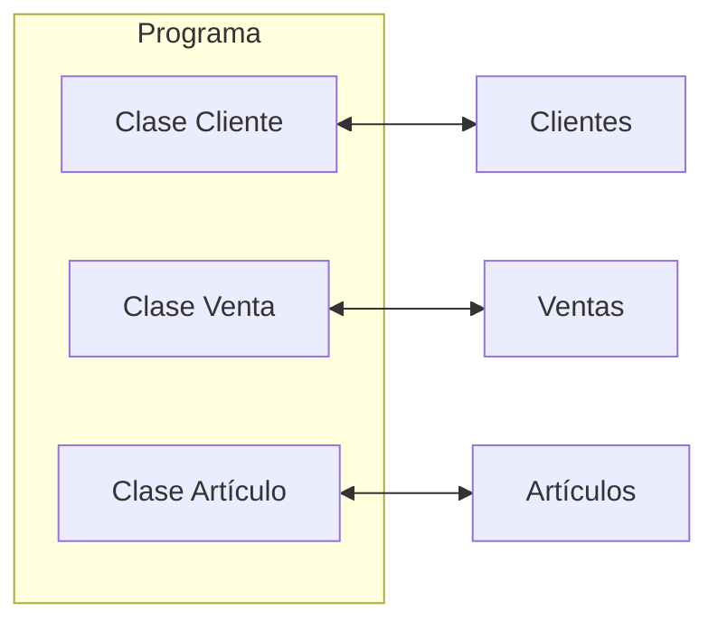

# Programación orientada a objetos (POO)

Paradigma que organiza el código alrededor de **objetos**, instancias de [[Clases y objetos|clases]], que combinan datos (atributos) y comportamiento (métodos) en una sola estructura y colaboran intercambiando mensajes (ver [[Métodos]]). En lugar de enfocarse en las acciones y funciones del programa, la POO se centra en la interacción entre objetos, lo que permite modelar entidades del mundo real de forma más precisa. Es uno de los paradigmas más usados, junto al estructurado y al [[Programación funcional|funcional]].

## Cuatro principios
- **Abstracción**: representar las características y comportamientos *esenciales* de un objeto en un modelo simplificado. Se identifican los atributos y métodos relevantes y se encapsulan en una clase.
- **[[Encapsulamiento]]**: ocultar los detalles internos del objeto y ofrecer una interfaz; los datos y las funciones se encapsulan en la clase y solo se accede a ellos por métodos públicos.
- **[[Herencia]]**: crear clases nuevas a partir de clases existentes. La subclase hereda atributos y métodos de la superclase y puede extender o especializar su funcionalidad.
- **[[Polimorfismo]]**: un objeto puede presentar distintas formas o comportamientos según el contexto. Se invoca el mismo método sobre objetos de una jerarquía y se obtienen resultados distintos, siempre que cumplan la interfaz común definida en la clase base.

## Por qué surgió
La POO surgió en la década de 1960 para organizar y diseñar software complejo. Antes, los programas se estructuraban en torno a funciones y procedimientos, con código difícil de mantener, extender y reutilizar. Al enfocarse en objetos —que contienen datos y comportamiento relacionado— el código se estructura de manera más intuitiva y modular, y los objetos interactúan por mensajes ocultando su funcionamiento interno. Favorece la reutilización de código y el diseño modular.

## Brecha semántica
Es la diferencia entre cómo se modela el mundo real en el software y cómo lo perciben usuarios y desarrolladores. Ejemplo: un sistema de ventas para un comercio, donde el análisis detecta los conceptos *artículos*, *clientes* y *ventas*.

- **Programación estructurada**: el software se redacta como una secuencia bastante larga de líneas de código, agrupadas con algún criterio pero orientadas a la funcionalidad. El programa es un bloque que no se parece a las entidades del dominio.

- **POO**: el código fuente se parece lo más posible a la realidad, con una clase por concepto. Todo software debe poder cambiar después de desarrollado (errores, requerimientos nuevos, cambios externos como la legislación vigente): con POO es más simple identificar dónde modificar y los cambios afectan pocos lugares. Si cambia el proceso de venta, el cambio queda localizado en la clase de la transacción de venta, no en las de artículo ni cliente.

## Conceptos relacionados
- [[Clases y objetos]] — la unidad básica de la POO
- [[Métodos]] y [[Referencias]] — cómo interactúan los objetos
- [[Encapsulamiento]], [[Herencia]], [[Polimorfismo]] — los otros principios
- [[Composición]] y [[Agregación]] — objetos formados por otros objetos
- [[Programación funcional]] — otro paradigma
- [[Funciones]] — base de la programación estructurada

## Visto en
- [[Unidad 4 - Clases, encapsulamiento y composición]] · [[semana4.pdf#page=1|semana4.pdf, §7.1 Introducción (p. 1-4)]]
