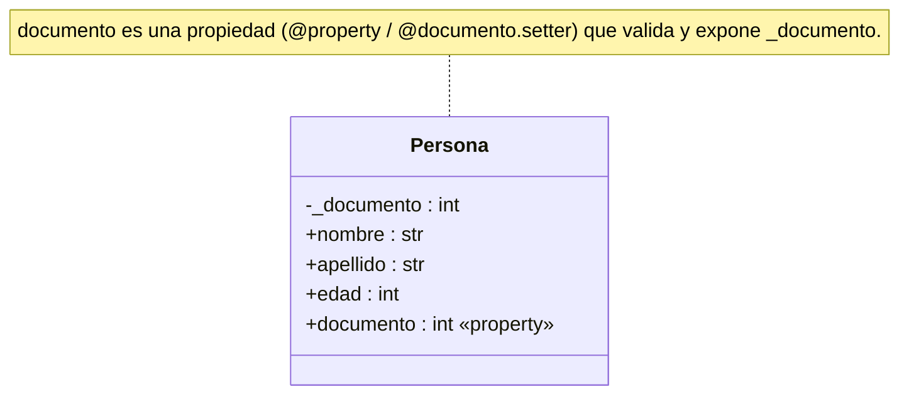

# Propiedades (`@property`)

Forma preferida de implementar el [[Encapsulamiento|encapsulamiento]] en Python. El decorador `@property` permite programar el método de **consulta** (*getter*) y el de **asignación** (*setter*) de un atributo, cada uno con la lógica que haga falta, tan simple o compleja como se requiera. Una vez definidos como par, el cliente sigue usando la sintaxis de un atributo simple (`p.documento`, `p.documento = 22`), pero de forma implícita se ejecutan los métodos.

## Sintaxis
- El **getter** se define con el nombre de la propiedad (un sustantivo) y se anota con `@property`.
- El **setter** se anota con `@nombre.setter` y recibe `self` y el nuevo valor.
- El dato real se guarda en un atributo **privado** con guion bajo inicial (`_documento`).

```python
class Persona:
    def __init__(self, documento, nombre, apellido, edad):
        self._documento = documento
        self.nombre = nombre
        self.apellido = apellido
        self.edad = edad

    @property
    def documento(self):
        return self._documento

    @documento.setter
    def documento(self, nuevo_documento):
        self._documento = nuevo_documento
```

```python
p = Persona(11, "Juan", "Perez", 23)
p.documento = 22        # ejecuta el método setter
print(p.documento)      # ejecuta el getter
```

## En el diagrama de clases
La propiedad se dibuja como si fuera un atributo público común (`documento`): el diagrama no distingue si el acceso ocurre por una propiedad o por un atributo simple, porque justamente esa es la idea del encapsulamiento —el cliente no necesita saberlo—. El atributo real (`_documento`) es privado.



Dentro del setter es donde se ubica la validación (por ejemplo rechazar un valor inválido lanzando una [[Excepciones|excepción]]).

## Conceptos relacionados
- [[Encapsulamiento]] — el principio que las propiedades implementan
- [[Métodos]] — getter y setter son métodos
- [[Clases y objetos]] — atributos públicos vs. privados
- [[Excepciones]] — validar en el setter
- [[Métodos mágicos]] — otro mecanismo de invocación implícita

## Visto en
- [[Unidad 4 - Clases, encapsulamiento y composición]] · [[semana4.pdf#page=17|semana4.pdf, §8.3 Propiedades (p. 17-18)]]
