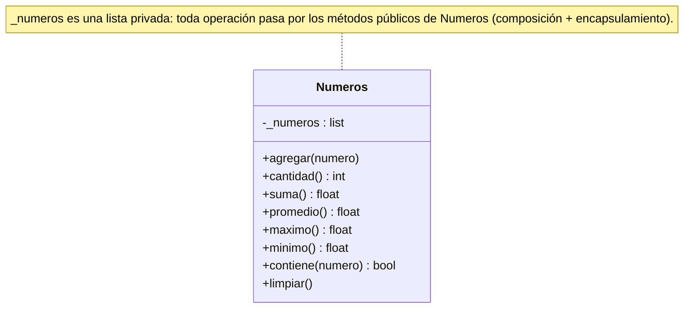

# Pytest

Framework de testing para Python, el estándar de facto para escribir y ejecutar [[Testing unitario|pruebas unitarias]]. Se destaca por su sintaxis simple y natural, su **autodescubrimiento** de pruebas y sus características avanzadas. Su gran ventaja es que las pruebas se escriben con la instrucción `assert` estándar de Python, sin aprender métodos propios del framework (ver [[Aserciones en pytest]]).

## Instalación y ejecución
```bash
pip install pytest
```

Ejecutar `pytest` descubre y corre automáticamente las pruebas del directorio actual y sus subdirectorios. Busca **archivos** que comiencen con `test_` o terminen en `_test.py` y, dentro, ejecuta las **funciones** que comiencen con `test_`.

```bash
pytest                    # todas las pruebas
pytest test_ejemplo.py    # un archivo específico
pytest -v                 # información más detallada
pytest -k "suma"          # solo las pruebas que contienen la palabra clave
```

Cuando una prueba falla, el reporte muestra exactamente qué aserción falló, los valores esperado vs. obtenido y el contexto del error.

## Estructura de las pruebas
Una **suite** es un conjunto de funciones de prueba organizadas en uno o más archivos; cada **caso de prueba** es una función que verifica un aspecto puntual del código.

```python
def test_ejemplo_basico():
    resultado = 2 + 2
    assert resultado == 4
```

Para las pruebas de una clase se recomienda un archivo separado `test_nombre_clase.py`. Dentro se pueden agrupar en **clases de prueba** (no es obligatorio):

```python
class TestCalculadora:
    def test_suma(self):
        calc = Calculadora()
        resultado = calc.sumar(2, 3)
        assert resultado == 5

    def test_division_por_cero(self):
        calc = Calculadora()
        with pytest.raises(ZeroDivisionError):
            calc.dividir(10, 0)
```

## Ejemplo de la cátedra: la clase `Numeros`
`Numeros` encapsula una colección de números y ofrece operaciones estadísticas. Aplica [[Composición|composición]] (contiene una lista) y [[Encapsulamiento|encapsulamiento]] (`_numeros` es privada: toda operación pasa por sus métodos públicos).



```python
class Numeros:
    def __init__(self):
        self._numeros = []

    def agregar(self, numero):
        if not isinstance(numero, (int, float)):
            raise TypeError("Solo se pueden agregar números")
        self._numeros.append(numero)

    def cantidad(self):
        return len(self._numeros)

    def suma(self):
        return sum(self._numeros)

    def promedio(self):
        if self.cantidad() == 0:
            raise ValueError("No se puede calcular el promedio de una colección vacía")
        return self.suma() / self.cantidad()

    def maximo(self):
        if self.cantidad() == 0:
            raise ValueError("No se puede obtener el máximo de una colección vacía")
        return max(self._numeros)

    def minimo(self):
        if self.cantidad() == 0:
            raise ValueError("No se puede obtener el mínimo de una colección vacía")
        return min(self._numeros)

    def contiene(self, numero):
        return numero in self._numeros

    def limpiar(self):
        self._numeros.clear()
```

### La suite de pruebas
Son 30 pruebas en una clase `TestNumeros` (`import pytest` y `from numeros import Numeros`, ver [[Módulos y docstrings]]), organizadas para cubrir casos normales, casos límite y situaciones de error. Cada una crea su propia instancia, así son independientes. Nombres descriptivos y un docstring por prueba.

| Grupo | Pruebas | Qué verifican |
|---|---|---|
| Estado inicial | `test_coleccion_vacia_inicial` | una instancia nueva está vacía |
| Agregar | `..._numero_entero`, `..._flotante`, `..._negativo`, `test_agregar_cero`, `..._multiple_numeros` | se aceptan enteros, flotantes, negativos, cero y varios |
| Agregar inválido | `..._tipo_invalido_cadena`, `..._tipo_invalido_lista` | `TypeError` ante una cadena o una lista |
| Suma | `test_suma_un_numero`, `..._multiples_numeros`, `..._numeros_negativos`, `..._coleccion_vacia` | la suma vacía es 0 |
| Promedio | `..._un_numero`, `..._multiples_numeros`, `..._con_flotantes`, `..._coleccion_vacia` | flotantes con `pytest.approx`; vacía → `ValueError` |
| Máximo | `..._un_numero`, `..._multiples_numeros`, `..._numeros_negativos`, `..._coleccion_vacia` | vacía → `ValueError` |
| Mínimo | `..._un_numero`, `..._multiples_numeros`, `..._numeros_positivos`, `..._coleccion_vacia` | vacía → `ValueError` |
| Contiene | `..._numero_presente`, `..._numero_ausente`, `..._coleccion_vacia` | pertenencia con `assert` / `assert not` |
| Limpiar | `test_limpiar_coleccion`, `test_operaciones_despues_limpiar` | tras `limpiar` la cantidad es 0 y promedio/máximo/mínimo fallan |
| Integración | `test_flujo_completo` | flujo entero de operaciones |

Ejemplos representativos:

```python
import pytest
from numeros import Numeros

class TestNumeros:

    def test_coleccion_vacia_inicial(self):
        """Verifica que una nueva instancia esté vacía"""
        coleccion = Numeros()
        assert coleccion.cantidad() == 0

    def test_agregar_tipo_invalido_cadena(self):
        """Verifica que se lance excepción al agregar una cadena"""
        coleccion = Numeros()
        with pytest.raises(TypeError, match="Solo se pueden agregar números"):
            coleccion.agregar("cinco")

    def test_promedio_con_flotantes(self):
        """Verifica el promedio con números flotantes"""
        coleccion = Numeros()
        coleccion.agregar(1.5)
        coleccion.agregar(2.5)
        assert coleccion.promedio() == pytest.approx(2.0)

    def test_promedio_coleccion_vacia(self):
        """Verifica que se lance excepción al calcular promedio de colección vacía"""
        coleccion = Numeros()
        with pytest.raises(ValueError, match="No se puede calcular el promedio de una colección vacía"):
            coleccion.promedio()

    def test_flujo_completo(self):
        """Prueba de integración que verifica un flujo completo de operaciones"""
        coleccion = Numeros()
        numeros = [2, 4, 6, 8, 10]
        for numero in numeros:
            coleccion.agregar(numero)

        assert coleccion.cantidad() == 5
        assert coleccion.suma() == 30
        assert coleccion.promedio() == 6
        assert coleccion.maximo() == 10
        assert coleccion.minimo() == 2

        for numero in numeros:
            assert coleccion.contiene(numero)
        assert not coleccion.contiene(7)
```

El listado completo, prueba por prueba, está en el PDF (p. 23-27).

## Conceptos relacionados
- [[Testing unitario]] — la práctica que automatiza
- [[Aserciones en pytest]] — igualdad, comparación, pertenencia, tipo, excepciones, aproximación
- [[Excepciones]] — `pytest.raises` verifica que se lance el error esperado
- [[Composición]] y [[Encapsulamiento]] — la clase `Numeros`
- [[Módulos y docstrings]] — importar la clase a probar

## Visto en
- [[Unidad 5 - Herencia, polimorfismo y testing]] · [[semana5.pdf#page=18|semana5.pdf, §12.2 Pytest (p. 18-19)]] · [[semana5.pdf#page=22|§12.4 Ejemplo (p. 22-27)]]
