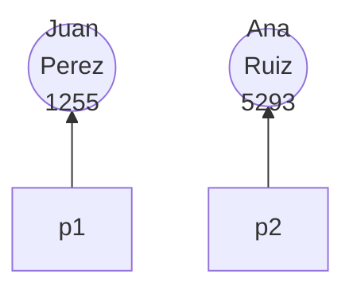
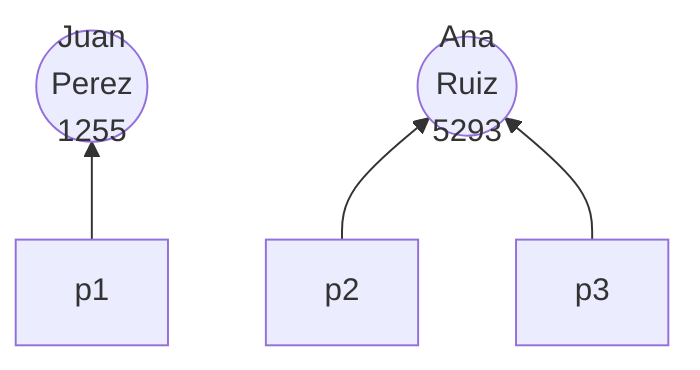
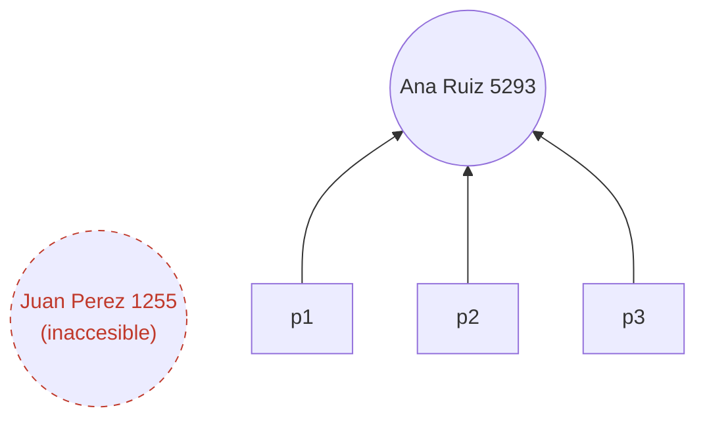

# Referencias

Las variables a las que se les asigna un objeto tienen tipo `object`, pero pensar que la variable *almacena* al objeto es incorrecto. La llamada al [[Constructor]] reserva memoria para el objeto, pero **los objetos no tienen nombre**: cada uno tiene una *identidad* —su dirección de memoria— y sin un nombre no se le pueden enviar mensajes. La variable de tipo referencia guarda esa identidad; conviene imaginar que guarda una **flecha** hasta el objeto.

```python
p1 = Persona(documento=1255, nombre="Juan", apellido="Perez")
p2 = Persona(documento=5293, nombre="Ana", apellido="Ruiz")
```



## Dos referencias, un mismo objeto
Cada referencia apunta a un único objeto, pero dos referencias pueden apuntar al **mismo**: enviar mensajes por una o por la otra afecta a la misma instancia. La asignación copia el valor de la variable, y en las referencias ese valor es la flecha.

```python
p3 = p2   # p3 queda apuntando al mismo objeto que p2
```



**La asignación no duplica objetos**: la única forma de crear un objeto nuevo es llamar al constructor.

## Objetos inaccesibles
Si un objeto deja de ser apuntado por alguna referencia queda inaccesible y por lo tanto inservible: no se le pueden enviar mensajes ni siquiera para consultar su estado. Si hace falta memoria, el intérprete de Python puede eliminarlo (en Python la memoria se gestiona por recolección de basura con conteo de referencias: un objeto vive mientras exista al menos una referencia hacia él).

```python
p1 = p2   # ninguna referencia apunta ya a Juan Perez
```



## Conceptos relacionados
- [[Clases y objetos]] — los objetos a los que se apunta
- [[Métodos]] — el operador punto recorre la flecha; una referencia en `None` no puede recibir mensajes
- [[Composición]] y [[Agregación]] — un objeto guarda referencias a otros objetos como atributos
- [[Tipos de datos]] — contraste con las variables "simples" de la programación estructurada

## Visto en
- [[Unidad 4 - Clases, encapsulamiento y composición]] · [[semana4.pdf#page=8|semana4.pdf, §7.5 Referencias (p. 8-10)]]
