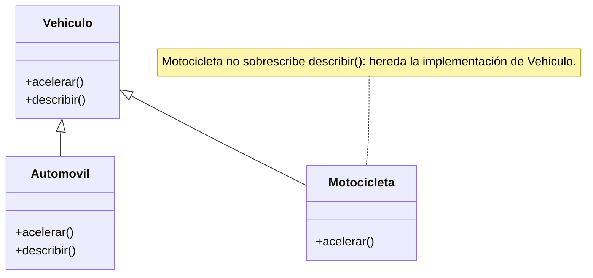

# Sobreescritura de métodos (override)

Mecanismo por el cual una clase derivada proporciona una implementación específica de un método que **ya existe en su clase base**. También se la llama *redefinición*. En Python la sintaxis es extremadamente sencilla: se define en la derivada un método con el **mismo nombre** que el de la base; no hacen falta palabras clave ni anotaciones.

```python
class Vehiculo:
    def acelerar(self):
        print("El vehículo está acelerando")

    def describir(self):
        print("Este es un vehículo genérico")

class Automovil(Vehiculo):
    def acelerar(self):
        print("El automóvil acelera suavemente")

    def describir(self):
        print("Este es un automóvil con cuatro ruedas")

class Motocicleta(Vehiculo):
    def acelerar(self):
        print("La motocicleta acelera rápidamente")
```



- `Automovil` redefine los dos métodos.
- `Motocicleta` redefine solo `acelerar`; `describir` lo **hereda** tal cual de `Vehiculo`.

## Reutilizar la versión de la base
Cuando la redefinición debe apoyarse en la implementación original —además de agregar lo propio— se usa [[Función super|`super()`]], sin caer en una llamada recursiva sobre sí misma. Es, junto con el [[Constructor|constructor]], el otro escenario habitual donde `super` es indispensable (por ejemplo `__str__`).

## Por qué importa
La sobreescritura es la técnica central del trabajo conjunto entre [[Herencia]] y [[Polimorfismo]]: sin métodos redefinidos en cada subclase, el mismo mensaje no podría producir comportamientos distintos.

## Conceptos relacionados
- [[Herencia]] — de donde se heredan los métodos
- [[Polimorfismo]] — el efecto que habilita
- [[Función super]] — invocar la versión original
- [[Métodos mágicos]] — `__str__` suele redefinirse
- [[Clases abstractas]] — métodos que las derivadas *deben* sobreescribir

## Visto en
- [[Unidad 5 - Herencia, polimorfismo y testing]] · [[semana5.pdf#page=7|semana5.pdf, §11.1.2 Sobreescritura de métodos (p. 7-8)]] · [[semana5.pdf#page=4|§10.3.2 (p. 4-5)]]
